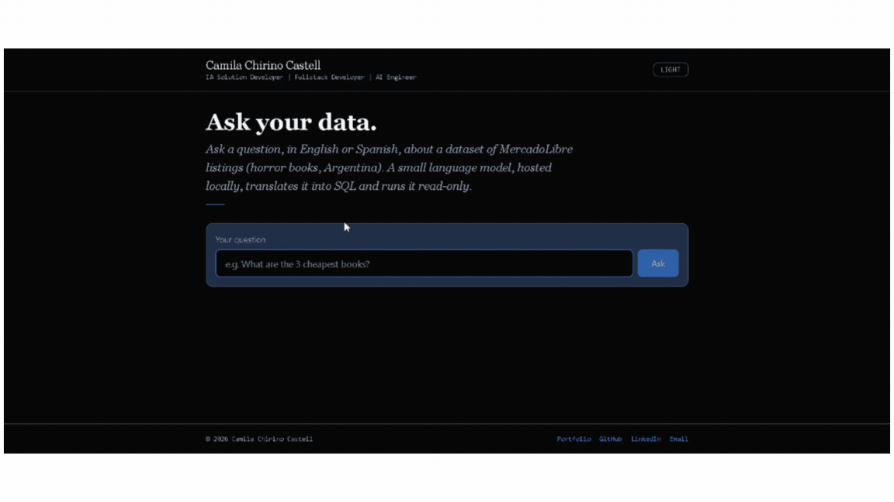
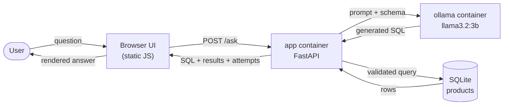

# NL-to-SQL App

System that lets a user ask questions in natural language about a CSV
dataset and get a correct answer, without writing SQL. The natural
language to SQL translation runs on a small language model hosted
locally via Ollama (no external API).

## Overview

The system loads a CSV into a SQL database and exposes it through an API.
A locally hosted model translates the user's natural language question
into a SQL query, which is validated and executed safely against the
database. The result is returned to the user.



## Tech stack

- Python
- FastAPI
- Ollama (local LLM inference)
- SQLite
- Pydantic
- JavaScript + `fetch` (frontend, decoupled from the API)
- Docker + Docker Compose

## Project status

🚧 In progress. See repository branches for feature-by-feature
development history.

## Environment variables

| Variable | Description |
|---|---|
| `OLLAMA_HOST` | Base URL of the Ollama inference API (overridden to `http://ollama:11434` by `docker-compose.yml` when running in Docker) |
| `OLLAMA_MODEL` | Name of the local model used for text-to-SQL |
| `OLLAMA_TIMEOUT_SECONDS` | Timeout for a single call to Ollama's `/api/generate` |
| `MAX_RETRIES` | How many times to retry generating SQL before giving up |
| `MAX_QUERY_RESULTS` | Max rows any generated query can return |
| `ASK_TIMEOUT_SECONDS` | Global timeout for `POST /ask`, independent of the per-attempt Ollama timeout |
| `WARMUP_MAX_RETRIES` | Max retries when warming up the model on startup (covers the initial model download) |
| `WARMUP_BACKOFF_SECONDS` | Wait time between warm-up retries |
| `DATABASE_PATH` | Path to the SQLite database file |
| `CSV_PATH` | Path to the source CSV dataset |

## Run

The project is designed to run with Docker — a single command starts
both services with no local Python setup required:

```bash
git clone <repo-url>
cd nl-to-sql-app
cp .env.example .env
docker compose up --build
```

The **first time** you run this, expect it to take several minutes —
Ollama needs to download the model (several GB) before the app can use
it. In testing, this took close to 5 minutes on a standard laptop with
no GPU. This is normal, not a hang; subsequent restarts are much faster,
since the model is cached in a Docker volume.

Once both services are up, the UI is available at
`http://localhost:8000`.

## Local installation (without Docker)

Useful for development or running the test suite directly:

```bash
git clone <repo-url>
cd nl-to-sql-app
python -m venv .venv
source .venv/Scripts/activate   # Windows (Git Bash)
pip install -r requirements-dev.txt
cp .env.example .env
```

This still requires Ollama running locally and reachable at the
`OLLAMA_HOST` set in `.env` (see [Environment variables](#environment-variables)).

## Testing the API

A Postman collection is included to test `/ask`, `/health` and
`/internal/query` independently from the UI:
- [Postman collection](postman/nl-to-sql-app.postman_collection.json) (import into Postman)
- [Published documentation](https://documenter.getpostman.com/view/58034286/2sBYHNWiNK) (view in browser, no Postman account needed)

## Project structure

```
app/
├── main.py          # FastAPI endpoints
├── db.py             # CSV loading, connection, and query execution
├── text_to_sql.py    # Prompt building, Ollama call, SQL validation
├── models.py          # Pydantic request/response models
└── static/             # Frontend (HTML/CSS/JS)
data/
└── data.csv
tests/
└── test_sql_validation.py
```


## Architecture and trade-offs

### System overview



### Model choice: a small general-purpose model, not a specialized one

The text-to-SQL translation runs on a small general-purpose model
(`llama3.2:3b`) via Ollama, instead of a model specialized for
text-to-SQL (e.g. SQLCoder) or a larger general-purpose model.

**Trade-off:** a small model is fast, runs without a dedicated GPU, and
is easy to host on any machine — but on its own, it produces lower-quality
SQL than a specialized or larger model would.

**How that quality gap is mitigated**, rather than left unaddressed:
- Full schema injection (table name, columns and types) in the prompt
- Few-shot examples (question → SQL) in the prompt
- Strict validation of the generated SQL before it's ever executed
- A retry loop: if the SQL is invalid or fails, the real error is fed
  back to the model, which gets up to 3 attempts to fix it
- A security layer that's independent of the model's behavior (see
  below) — the system never trusts the model's output blindly, even if
  all of the above fails

### One application service, not three

The system is split into two containers: `app` (this project's backend —
loads the CSV, builds prompts, validates and executes SQL, serves the
UI) and `ollama` (hosts the model and exposes its inference API). Within
`app`, the database access, text-to-SQL and UI-serving responsibilities
live in the same service rather than three separate ones.

**Why:** the assignment explicitly allows this simplification ("one
service (monolith) for all the tasks... Simplicity is highly desirable
and valuable — KISS"). These three responsibilities are always deployed
and scaled together in this project's scope — splitting them into
separate services wouldn't add real value here, only operational
overhead (more containers to coordinate, more network calls between
pieces that have no independent reason to scale differently).

### Frontend: vanilla JS + `fetch`, not server-rendered HTML

Three options were considered: server-side rendering with Jinja2, an
all-in-one Python framework (Streamlit), and JavaScript with `fetch()`
consuming a JSON API. Vanilla JS was chosen.

**Why:** the assignment describes the system in terms of services that
"expose an API endpoint" and explicitly asks for "modularity and clear
separation of concerns." With Jinja2, the same endpoint that should
expose a clean API ends up returning HTML instead of JSON — mixing
presentation with business logic. With `fetch()`, the backend exposes a
pure JSON API, independently testable from the UI (see the Postman
collection above), and the frontend is a thin, decoupled layer that
consumes it. The assignment explicitly exempts the UI from being in
Python, so this doesn't compromise the "code should be in Python"
requirement — all of the real logic (model orchestration, validation,
SQL execution) is 100% Python.

**Trade-off:** loading and error states have to be managed asynchronously
in JS, instead of the server assembling a finished page. This is
well-understood territory (not new learning curve), not a hidden cost.

### Portability over raw performance

Two decisions prioritize "runs reliably on someone else's machine" over
squeezing out extra speed:

- **CPU-only inference**, forced via `CUDA_VISIBLE_DEVICES=-1` on the
  `ollama` service. Giving a Docker container GPU access requires the
  NVIDIA Container Toolkit installed on the host — something most
  evaluation machines won't have. Since GPU passthrough is unreliable
  and not guaranteed to exist, the system is designed to work
  acceptably on CPU alone, rather than assume a GPU that may not be
  there.
- **Explicit DNS resolver for the `app` service**
  (`dns: [127.0.0.11]` in `docker-compose.yml`). During testing, a VPN
  client on the development machine interfered with Docker's internal
  DNS, breaking service-name resolution between containers. Forcing
  Compose's embedded resolver fixes this permanently, without requiring
  anyone running the project to change their own network setup — a
  good example of the kind of environment-specific issue this project
  tries to shield the evaluator from.

### Git workflow

GitHub Flow (not full Git Flow): `main` stays always in a working state,
and each phase/feature is built on its own short-lived branch
(`feature/`, `fix/`, `chore/`), merged once working and tested. Chosen
for being simple and sufficient for a one-week individual project — full
Git Flow's `develop`/`release`/`hotfix` branches solve problems (multiple
environments, coordinated team releases) that don't exist at this scale.


## Scalability

### If the tables grow in size and number

Migrate from SQLite to PostgreSQL, with indexes on the most frequently
queried columns. A read-replica setup, separated from any future writes,
would also make sense at that point.

### If the dataset moves from a static snapshot to live-updated data

Today, adding per-row `created_at`/`updated_at` columns wouldn't add real
value — the table is recreated from scratch on every load (`DROP TABLE` +
`CREATE TABLE`), so every row would share the exact same timestamp,
always. If the data started updating incrementally instead of via full
snapshot reloads, per-row timestamps would become genuinely useful, along
with the indexes mentioned above.

### If traffic to the interface increases

The API (`app`) is stateless, so it can scale horizontally behind a load
balancer with multiple replicas. The real bottleneck won't be the
database — it'll be **model inference**. The next steps there would be a
job queue (so requests don't block each other while the model is
processing) and, budget allowing, moving from Ollama to a
production-oriented inference runtime (e.g. vLLM), which serves multiple
concurrent requests far more efficiently.

## Possible improvements

- **Out-of-domain question detection**: the system currently answers
  any syntactically valid question, even when no column is semantically
  related to what was asked (e.g. "what is the weight of each book?"
  returns the `price` column, since no `weight` column exists). A
  possible mitigation is a second, lightweight LLM call that classifies
  whether the question is answerable from the schema before generating
  SQL — not attempted here due to the added latency and the risk of
  unreliable classification from a small model.
- **Human-readable answers**: a second model call that turns the raw SQL
  result into a natural-language sentence (e.g. "Alfajor 70% cacao is
  the most bought product on Fridays"), as described in the assignment's
  bonus task.
- **Rate limiting**: per-IP or per-session request limits on `/ask`, to
  protect the model-serving capacity under real traffic.
- **Authentication**: not needed for this take-home's scope, but would
  be the first addition before exposing this publicly.
- **Per-row timestamps**: not useful today, since the dataset is a full
  snapshot reload rather than incremental updates — see
  [Scalability](#scalability) for when this would start to matter.

## Author

Camila Chirino Castell —
💻 Portfolio: [camilachirinocastell-portfolio.netlify.app](https://camilachirinocastell-portfolio.netlify.app)
🐙 GitHub: [github.com/camilachirinocastell](https://github.com/camilachirinocastell)
👤 LinkedIn: [www.linkedin.com/in/camila-chirino-castell](https://www.linkedin.com/in/camila-chirino-castell)
